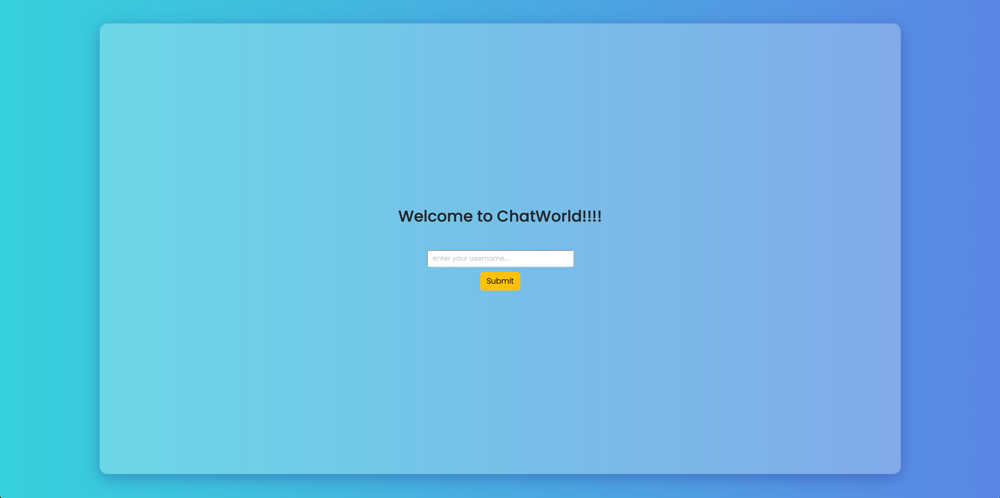
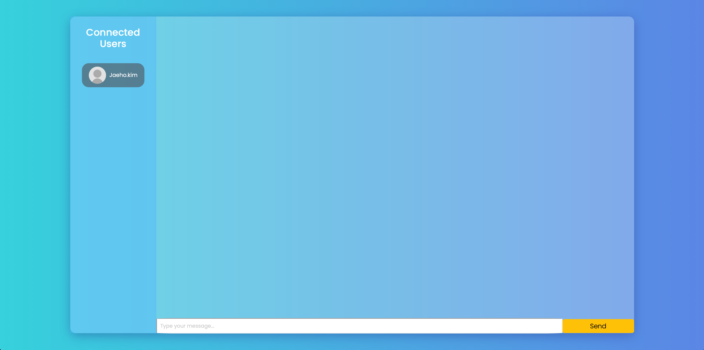
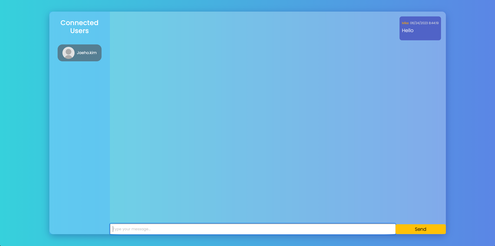
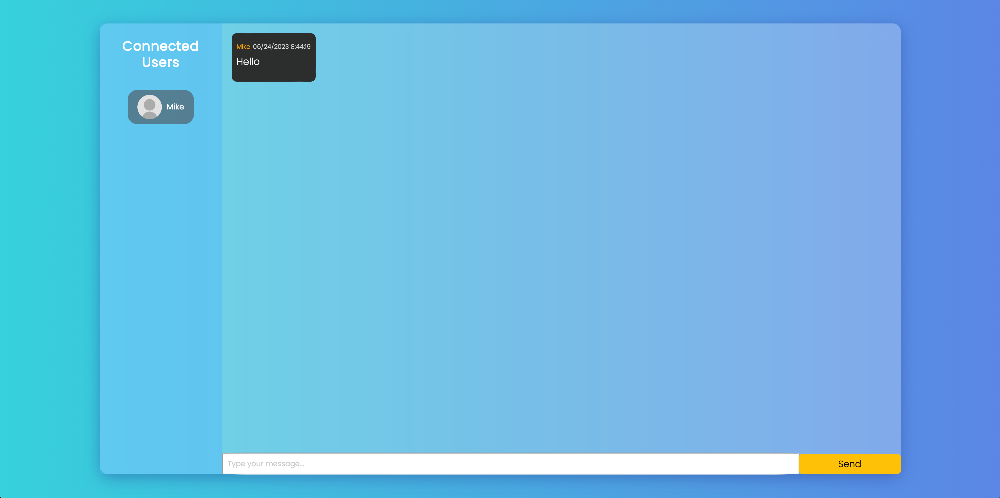
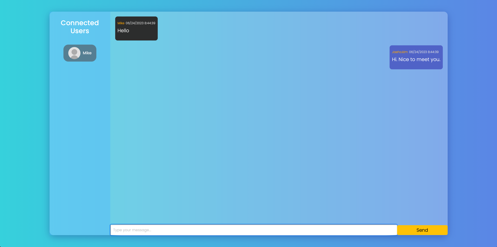
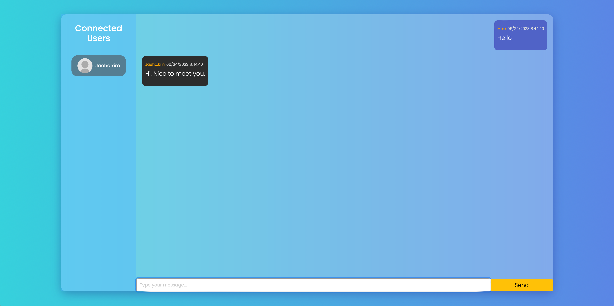

## What project is it?

This project is real-time chat application with socket.io. 

## Homepage

<a href="http://chat.thejaehokim.com" target='_blank'>ChatWorld</a>

## Languages

## Server Code gitHub

<a href="https://github.com/jaehokimdev/ChatWorld-server" target='_blank'>ChatWorld-Server</a>

## How to run this program?

1. Download the master project brach or clone the git repository
2. To install node modules, run the following command. `npm install`
3. Type the following command for start this program. `npm start`

## Functions and screenshots

Login

Chat with other users

*****

*****

*****

*****

